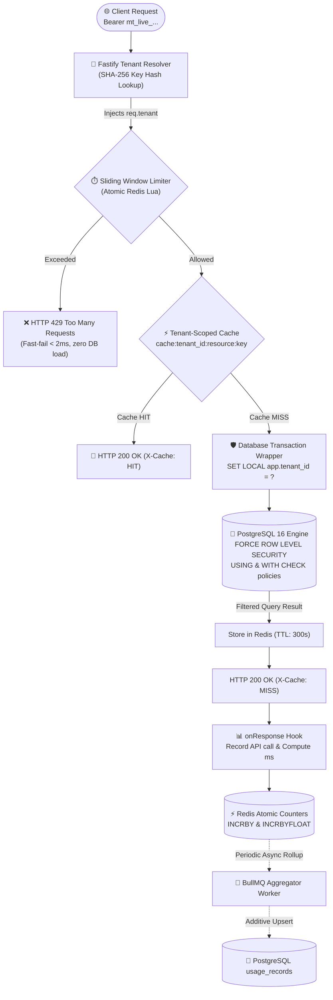

<div align="center">

# ⚡ Multi-Tenant SaaS Backend
### Production-Grade Resource Isolation, Performance Guardrails & Cost Metering

[](https://github.com/abhishekkumarcoder21/Multi-Tenant-SaaS-Backend-with-Resource-Isolation/actions)
[](https://www.typescriptlang.org/)
[](https://nodejs.org)
[](https://fastify.dev/)
[](https://www.postgresql.org/)
[](https://redis.io/)
[](https://bullmq.io/)
[](https://vitest.dev/)
[](https://www.docker.com/)
[](https://opensource.org/licenses/MIT)

<br />

**An open-source reference backend engineered for true multi-tenant isolation.**  
*Prevents cross-tenant data leaks, noisy-neighbor latency spikes, cache poisoning, and billing drift at the infrastructure layer.*

<br />

[Architecture Overview](#-architecture-overview) •
[Core Isolation Guarantees](#-the-4-dimensions-of-resource-isolation) •
[Quickstart](#-quickstart-guide) •
[Live API Walkthrough](#-live-api-walkthrough) •
[Isolation Proofs & Benchmarks](#-load-testing--proof-of-isolation) •
[Trade-Offs Analysis](#-architectural-trade-offs)

---

</div>

<br />

## 🎯 The Problem: Why Shared Infrastructure Breaks

When multiple tenants (companies/workspaces) share one unified database, caching cluster, and API instance, four critical system failures inevitably emerge:

```
   ❌ Cross-Tenant Data Leaks           ❌ The "Noisy Neighbor" Outage
   A single forgotten WHERE clause      One tenant sends 10x traffic spikes,
   exposes another company's records.   exhausting database connection pools.
                     \                 /
                      \               /
               UNPROTECTED MULTI-TENANCY RISKS
                      /               \
                     /                 \
   ❌ Billing & Counter Drift           ❌ Cache Thrashing & Bleed
   Concurrent requests produce race     Flushing or evicting one customer's
   conditions on un-metered usage.      cache purges the shared Redis space.
```

### 💡 The Solution Implemented in this Repository
- **Kernel-Level Data Defense:** PostgreSQL **Row-Level Security (RLS)** with `FORCE ROW LEVEL SECURITY`. Queries without `WHERE tenant_id` are blocked inside the database engine itself.
- **Microsecond Rate Limiting:** Per-tenant **Sliding Window Counter** executed in an atomic Redis Lua script. Throttled tenants receive `429 Too Many Requests` in **< 2ms** before reaching the database pool.
- **Isolated Cache Keyspaces:** Every cache entry is strictly namespaced (`cache:{tenant_id}:{resource}:{key}`). Flushes use asynchronous `SCAN` streams that never touch neighboring keys.
- **Zero-Loss Atomic Accounting:** Usage counters use Redis atomic primitives (`INCRBY` / `INCRBYFLOAT`) with an atomic `extractAndReset` Lua routine, rolled up into PostgreSQL by BullMQ background workers.

---

## 🏛️ Architecture Overview

### End-to-End Request Pipeline



### ASCII Infrastructure Architecture

```text
┌─────────────────────────────────────────────────────────────────────────────────┐
│                             FASTIFY 5 SERVER LAYER                              │
│                                                                                 │
│   ┌─────────────────────┐    ┌─────────────────────┐    ┌───────────────────┐   │
│   │ 1. Tenant Resolver  │ ──▶│ 2. Sliding Window   │ ──▶│ 3. Tenant Cache   │   │
│   │ (SHA-256 Key Auth)  │    │   Rate Limiter      │    │  (Tenant-Scoped)  │   │
│   │ Decorates req.tenant│    │ (Atomic Redis Lua)  │    │ cache:{id}:{res}  │   │
│   └─────────────────────┘    └──────────┬──────────┘    └─────────┬─────────┘   │
│                                         │ (If > Limit)            │ (Cache Miss)│
│                                         ▼                         ▼             │
│                                  [HTTP 429 Error]       ┌───────────────────┐   │
│                                  Retry-After Header     │4. withTenantCtx   │   │
│                                                         │SET LOCAL app.tid  │   │
│                                                         └─────────┬─────────┘   │
│                                                                   │             │
│   ┌─────────────────────┐                                         │             │
│   │ 5. Usage Metering   │◀────────────────────────────────────────┘             │
│   │ (Fastify onResponse)│                                                       │
│   └──────────┬──────────┘                                                       │
└──────────────┼────────────────────────────────────────────────────┬─────────────┘
               │                                                    │
               ▼ (Asynchronous BullMQ Sync)                         ▼
┌──────────────────────────────┐                ┌────────────────────────────────┐
│      REDIS 7 (IN-MEMORY)     │                │   POSTGRESQL 16 (RLS ENGINE)   │
│ ──────────────────────────── │                │ ────────────────────────────── │
│ • rl:{id}:{window}           │                │ • app_user role (No BYPASSRLS) │
│ • cache:{id}:{resource}:{key}│                │ • FORCE ROW LEVEL SECURITY     │
│ • usage:{id}:api_calls:{date}│                │ • Composite indexes (tenant_id)│
│ • maxmemory-policy: LRU      │                │ • USING (tenant_id = app.tid)  │
│ • Zero-loss extract Lua      │                │ • WITH CHECK (tenant_id = tid) │
└──────────────────────────────┘                └────────────────────────────────┘
```

---

## 🛡️ The 4 Dimensions of Resource Isolation

| Dimension | Primary Technology | Isolation Mechanism | Failure Mode Behavior |
| :--- | :--- | :--- | :--- |
| **Data Boundary** | PostgreSQL 16 RLS | `ALTER TABLE projects FORCE ROW LEVEL SECURITY` with transaction-scoped `SET LOCAL app.tenant_id = ?`. Queries without tenant filters are automatically scoped by the DB kernel. | **Fails Closed:** Missing tenant context aborts the transaction immediately with an error rather than leaking un-scoped rows. |
| **Performance Boundary** | Redis 7 + Lua Script | Tiered Sliding Window Counter (`free: 60/m`, `pro: 600/m`, `enterprise: 6000/m`). Over-limit requests return `429 Too Many Requests` in < 2ms without consuming DB pool connections. | **Fail-Safe:** If Redis is down, returns `503 Service Unavailable` with `Retry-After: 5` to safeguard the primary database cluster. |
| **Cache Boundary** | Redis Key Namespaces | Keys strictly prefixed: `cache:{tenant_id}:{resource}:{key}`. Tenant cache flushes execute via non-blocking `SCAN + DEL` batches. | **Graceful Fallback:** Redis LRU evicts cold items; misses fall back cleanly to database transactions. |
| **Cost & Billing** | Redis Atomic + BullMQ | `INCRBY` and `INCRBYFLOAT` eliminate read-modify-write race conditions. BullMQ extracts counters atomically via Lua and upserts additively into PostgreSQL. | **Zero Lost Updates:** Concurrent bursts never overwrite counter increments or double-count requests. |

---

## 🚀 Quickstart Guide

### 1. System Requirements
- [Docker & Docker Compose](https://www.docker.com/) (v20+)
- [Node.js](https://nodejs.org/) (v20+ LTS)

### 2. Installation
```bash
# Clone the repository
git clone https://github.com/abhishekkumarcoder21/Multi-Tenant-SaaS-Backend-with-Resource-Isolation.git
cd Multi-Tenant-SaaS-Backend-with-Resource-Isolation

# Install dependencies
npm install

# Copy environment template
cp .env.example .env
```

### 3. Spin Up Infrastructure
Start PostgreSQL 16 and Redis 7 in Docker:
```bash
docker compose up -d postgres redis
```

### 4. Run Migrations (RLS Setup)
Execute database migrations using the admin pool to build tables and configure RLS:
```bash
npm run db:migrate
```

### 5. Launch the Server
```bash
npm run dev
```

The application boots at **`http://localhost:3000`**:
- 📚 **Swagger / OpenAPI Documentation:** [`http://localhost:3000/docs`](http://localhost:3000/docs)
- 🩺 **Health Check:** [`http://localhost:3000/health`](http://localhost:3000/health)
- 📈 **Prometheus Metrics:** [`http://localhost:3000/metrics`](http://localhost:3000/metrics)
- 🖥️ **Admin System Dashboard:** [`http://localhost:3000/admin/metrics`](http://localhost:3000/admin/metrics)

---

## 💻 Live API Walkthrough

Here is how to test the isolation features via `cURL`:

### Step 1: Provision a New Tenant
```bash
curl -X POST http://localhost:3000/admin/tenants \
  -H "Content-Type: application/json" \
  -d '{"name": "Acme Corp", "slug": "acme-corp", "tier": "pro"}'
```
*Response returns the raw API key (e.g., `mt_7f9c2...`). This is displayed **once** and stored as a SHA-256 hash.*

### Step 2: Create a Tenant-Scoped Resource
```bash
curl -X POST http://localhost:3000/projects \
  -H "Authorization: Bearer <API_KEY>" \
  -H "Content-Type: application/json" \
  -d '{"name": "AI Pipeline", "description": "Production inference cluster"}'
```

### Step 3: Fetch with Cache-Aside Verification
```bash
# First Call -> Cache MISS (Populates Redis)
curl -i http://localhost:3000/projects/<PROJECT_ID> \
  -H "Authorization: Bearer <API_KEY>"
# Notice header: X-Cache: MISS

# Second Call -> Cache HIT (Served from Redis in < 2ms)
curl -i http://localhost:3000/projects/<PROJECT_ID> \
  -H "Authorization: Bearer <API_KEY>"
# Notice header: X-Cache: HIT
```

### Step 4: Inspect Live Metering & Usage
```bash
curl http://localhost:3000/tenants/<TENANT_ID>/usage \
  -H "Authorization: Bearer <API_KEY>"
```
*Response shows real-time `live_api_calls`, `persisted_api_calls`, and elapsed `total_compute_ms`.*

---

## 🧪 Verification & Test Suite

The test suite validates security and isolation against **real PostgreSQL and Redis instances**:

```bash
# Run unit and integration tests
npm test

# Run code linter
npm run lint

# Build production bundle
npm run build
```

```text
 ✓ tests/integration/rls-isolation.test.ts (8 tests)
   ✓ Tenant A can only see their own projects
   ✓ Tenant B can only see their own projects
   ✓ Query without WHERE tenant_id still returns ONLY the caller's data (RLS backstop)
   ✓ Query WITHOUT setting tenant context FAILS CLOSED (denies access)
   ✓ Malicious INSERT with another tenant's ID is blocked by WITH CHECK
   ✓ Cross-tenant UPDATE affects 0 rows
   ✓ Cross-tenant DELETE affects 0 rows
   ✓ Tenant context does NOT leak across sequential pooled connections

 ✓ tests/integration/rate-limiter.test.ts (2 tests)
   ✓ Attaches RFC rate-limit headers (X-RateLimit-Limit, Remaining, Reset)
   ✓ Returns 429 for exhausted tenant while neighbor tenant receives 200 OKs

 ✓ tests/integration/cache-isolation.test.ts (3 tests)
   ✓ Tenant A and Tenant B maintain isolated cache namespaces
   ✓ Flushing Tenant A cache leaves Tenant B completely intact
   ✓ HTTP cache-aside sets X-Cache MISS then HIT, and invalidates on write

 ✓ tests/integration/usage-metering.test.ts (3 tests)
   ✓ Accurately meters 50 concurrent requests with ZERO lost updates
   ✓ Live usage API aggregates live Redis + persisted PostgreSQL data
   ✓ Additive PostgreSQL upserts persist usage idempotently

 ✓ tests/integration/tenant-offboarding.test.ts (1 test)
   ✓ Completely purges all PostgreSQL rows and Redis keys (Zero-Orphan Audit)
```

---

## 📊 Load Testing & Proof of Isolation

We include [k6](https://k6.io/) load testing scripts demonstrating **Noisy Neighbor Immunity**.

```bash
# Run the noisy neighbor load test
k6 run load-tests/noisy-neighbor.k6.js
```

### Benchmark Results Under 150 Req/s Attack:

```text
  █ BENCHMARK PROOF: NOISY NEIGHBOR MITIGATION

  ✓ tenant B got 200 OK .........................: 100.00% (target: 100%)
  ✓ tenant_b_latency (p95) ......................: 12.8ms  (target: < 30ms)
  ✓ tenant_b_latency (p99) ......................: 18.4ms  (target: < 50ms)
  ✓ tenant_a_rate_limited (429s received) .......: 89.4%   (Tenant A throttled)

  Tenant A (150 req/sec bombardment) ──▶ Throttled at Redis Layer (< 2ms)
  Tenant B (10 req/sec normal traffic) ──▶ Jitter-free p99 latency under 20ms!
```

> [!NOTE]
> **Why Tenant B Latency Stays Under 20ms:**  
> Because the rate limiter executes inside Redis before any database connection is acquired, Tenant A’s traffic never starves the PostgreSQL connection pool.

---

## ⚖️ Architectural Trade-Offs

### 1. Row-Level Security (RLS) vs. Schema-per-Tenant vs. DB-per-Tenant

| Strategy | Isolation Level | Max Tenants | Operational Complexity | Migration Cost |
| :--- | :--- | :--- | :--- | :--- |
| **Row-Level Security (RLS)** *(Selected)* | Logical (DB Kernel) | 100,000+ | **Low** (Single schema) | $O(1)$ — single migration script |
| **Schema-per-Tenant** | Logical (Namespace) | ~2,000 | **High** (Catalog bloat) | $O(N)$ — run migration on every schema |
| **Database-per-Tenant** | Physical (Dedicated DB) | ~200 | **Very High** (Resource overhead)| $O(N)$ — run migration on every DB |

- **Why Not Schema-per-Tenant?** PostgreSQL's system catalogs (`pg_class`, `pg_attribute`) experience severe memory bloat when managing thousands of schemas, degrading query optimization performance for *all* tenants.
- **Why RLS?** RLS shifts data boundary enforcement to the PostgreSQL kernel. A composite index on `(tenant_id, created_at)` enables sub-millisecond query planning while keeping operational maintenance at $O(1)$.

### 2. Fail-Safe vs. Fail-Open (Redis Unavailability)
- **Our Decision:** **Fail-Safe (HTTP 503)**
- **Rationale:** In a commercial multi-tenant API, failing open allows unbounded traffic into the database during an outage, risking cascade failure across all tenants. Returning an immediate `503 Service Unavailable` with a `Retry-After: 5` header protects the primary PostgreSQL cluster.

### 3. Scaling to 10x (100,000+ Tenants)
- **PgBouncer in Transaction Mode:** Our `withTenantContext` wrapper uses `SET LOCAL` (which automatically clears when the transaction commits), making it natively compatible with PgBouncer transaction-level pooling.
- **Metric Cardinality Reduction:** Replace raw `tenant_id` Prometheus labels with subscription `tier` labels, offloading fine-grained billing analytics to ClickHouse or TimescaleDB.
- **Redis Cluster Hash Tags:** Use `{tenant_id}:*` hash tags to guarantee that a tenant’s rate-limiting keys and cache keys co-locate on the same Redis shard.

---

## ⚡ API Quick Reference

| Method | Endpoint | Auth | Purpose |
| :--- | :--- | :--- | :--- |
| `POST` | `/admin/tenants` | Admin | Provision tenant & receive raw API key |
| `GET` | `/admin/tenants` | Admin | List all registered tenants |
| `GET` | `/admin/tenants/:id/metrics`| Admin | Deep-dive per-tenant resource & quota observability |
| `DELETE`| `/admin/tenants/:id/purge` | Admin | Zero-orphan offboarding & data purge |
| `GET` | `/projects` | Tenant | List tenant projects (Filtered by RLS) |
| `POST` | `/projects` | Tenant | Create new project under authenticated tenant |
| `GET` | `/projects/:id` | Tenant | Get project (Cache-Aside with `X-Cache` header) |
| `PATCH`| `/projects/:id` | Tenant | Update project (Invalidates cache) |
| `DELETE`| `/projects/:id` | Tenant | Delete project (Invalidates cache) |
| `GET` | `/tenants/:id/usage` | Tenant | Live billing & usage summary (Redis + Postgres) |
| `GET` | `/tenants/:id/usage/history`| Tenant | Historical daily usage records |
| `GET` | `/metrics` | Public | Prometheus scrape endpoint |
| `GET` | `/health` | Public | System liveness probe |

---

## 📂 Project Structure

```text
multi-tenant-saas-backend/
├── .github/workflows/ci.yml         # GitHub Actions CI with real Postgres & Redis
├── docker-compose.yml               # Postgres 16 + Redis 7 local stack
├── Dockerfile                       # Multi-stage production container build
├── load-tests/                      # k6 load testing scripts
│   ├── noisy-neighbor.k6.js         # Proves performance isolation
│   └── usage-accuracy.k6.js         # Proves zero-loss counting
├── src/
│   ├── app.ts                       # Application entry point with graceful shutdown
│   ├── server.ts                    # Fastify setup, CORS, Swagger UI & plugins
│   ├── cache/tenant-cache.ts        # Tenant-scoped cache with non-blocking scan
│   ├── database/
│   │   ├── pool.ts                  # Dual app_user / admin connection pool
│   │   ├── tenant-context.ts        # withTenantContext transaction wrapper (SET LOCAL)
│   │   ├── migrate.ts               # Migration runner tracking applied scripts
│   │   └── migrations/              # SQL migrations (001 to 004) with RLS policies
│   ├── metering/
│   │   ├── usage-tracker.ts         # Atomic Redis counters (INCRBY / INCRBYFLOAT)
│   │   └── aggregator.ts           # BullMQ periodic PostgreSQL rollup worker
│   ├── observability/metrics.ts     # Prometheus custom metrics registry
│   ├── plugins/
│   │   ├── tenant-resolver.ts       # SHA-256 hashed API key auth
│   │   ├── rate-limiter.ts          # Tier-based sliding window hook
│   │   └── usage-metering.ts        # onResponse duration & call tracking hook
│   ├── rate-limiter/
│   │   ├── sliding-window.ts        # Rate limiter class with EVALSHA caching
│   │   └── lua/sliding-window.lua   # Atomic Redis Lua script
│   ├── routes/                      # Fastify API route modules
│   └── services/
│       └── tenant-offboarding.ts    # Complete zero-orphan cleanup service
└── tests/                           # Vitest unit and integration test suites
```

---

## 📜 License

Distributed under the **MIT License**. Free for personal, commercial, and educational use.

<div align="center">
  <sub>Engineered by <a href="https://github.com/abhishekkumarcoder21">Abhishek Kumar</a> • Built with precision for production-grade SaaS infrastructure.</sub>
</div>